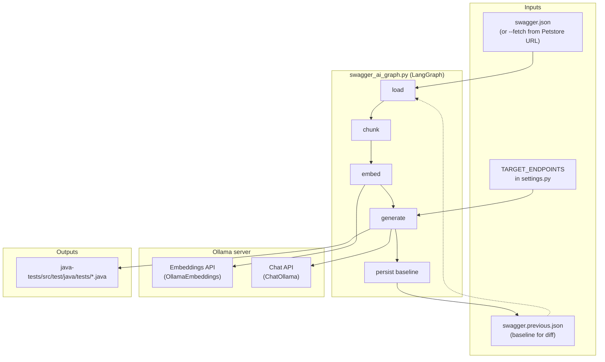
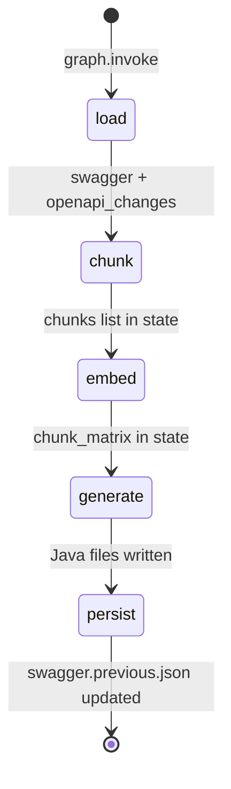
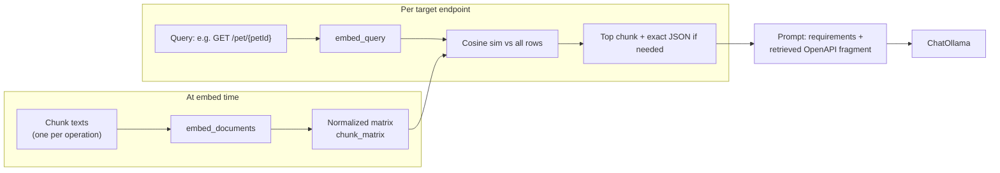
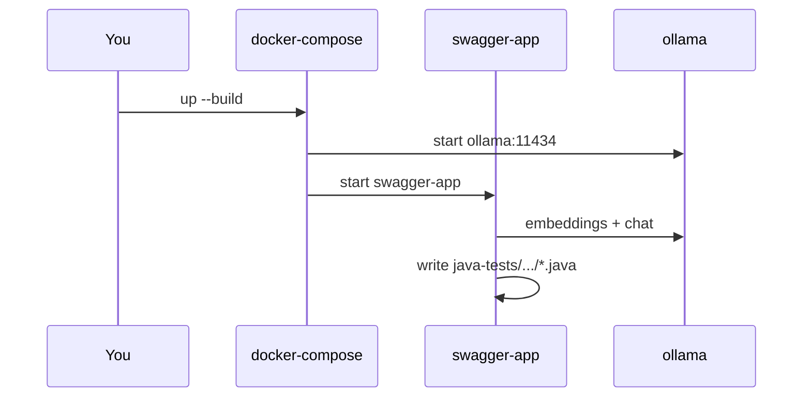

# Swagger AI (LangGraph + LangChain + RAG)

This repository reads an **OpenAPI (Swagger) JSON** specification, retrieves the right operation fragments with **embeddings (RAG)**, calls **Ollama** with **LangChain** `ChatOllama`, and writes **Java TestNG + Rest Assured** test classes for a fixed set of Petstore endpoints.

---

## What runs where (big picture)



---

## LangGraph flow (each node, in order)

The graph is a **linear state machine**: one node hands its state to the next. There is no branching yet (easy to extend later with validation or retry nodes).



| Step | Node | What happens |
|------|------|----------------|
| 1 | **load** | Loads current spec (`--fetch` or `swagger.json`). Compares to **`swagger.previous.json`** if present; fills **`openapi_changes`** (added / removed / modified operations) via `graph/swagger_diff.py`. Prints a short summary. |
| 2 | **chunk** | Walks `swagger["paths"]`. For each HTTP method and path, builds one text chunk: method + path + pretty-printed operation JSON. State field: `chunks` (list of `{path, method, text}`). |
| 3 | **embed** | Calls **Ollama** embedding model (`OLLAMA_EMBED_MODEL`, default same as chat) for every chunk via `OllamaEmbeddings.embed_documents`. Vectors are **L2-normalized** and stored as `chunk_matrix` (list of rows) for cosine similarity. |
| 4 | **generate** | For each target in `TARGET_ENDPOINTS`: **incremental by default** when a baseline exists — calls the LLM and overwrites a test only if that operation is **added/modified** vs baseline *or* the Java file is **missing**; unchanged ops with an existing file are **skipped**. Use `--force-all` to regenerate everything. `--changed-only` is stricter (only diff-touched targets, even if another test file is missing). |
| 5 | **persist** | Writes the current `swagger` dict to **`swagger.previous.json`** so the next run can diff again. |

---

## OpenAPI change detection (no vector DB)

- **Baseline file:** `swagger.previous.json` (gitignored by default). Created/updated at the end of each successful full graph run.
- **Diff:** `graph/swagger_diff.py` compares the last baseline to the current spec and lists **added**, **removed**, and **modified** `(path, method)` operations (JSON fingerprints of each operation object).
- **CLI:**
  - `python swagger_ai_graph.py --diff-only` — print summary + JSON diff, then exit (no Ollama). With `--fetch`, refreshes `swagger.json` first.
  - **Default (with baseline):** only **changed** targets (added/modified) or **missing** `*Test.java` files hit the LLM; existing tests for unchanged APIs are left as-is.
  - `python swagger_ai_graph.py --force-all` — run the LLM for every target, even when nothing changed and files exist (e.g. CI or full refresh).
  - `python swagger_ai_graph.py --changed-only` — consider **only** targets that appear in added/modified; skips other targets even if their test file is missing. If there is no baseline yet, behaves like a full run (all targets), then creates the baseline.

Structured snapshots + diff are enough for “what changed”; a **vector database** is optional if you later want semantic search over many historical documents, not for exact API drift.

---

## RAG retrieval (how context reaches the LLM)



---

## Ollama: `/api/embed` vs `/api/chat`

Ollama does **not** provide a separate `/api/messages` endpoint. Chat generation uses **`POST /api/chat`** with a JSON field **`messages`** (e.g. `[{"role": "user", "content": "..."}]`). LangChain’s `ChatOllama` talks to that chat API.

| Endpoint | Purpose in this repo |
|----------|----------------------|
| **`POST …/api/embed`** | Turns text into a **numeric vector** (embedding). We embed every chunk’s `text`, then embed each query like `GET /pet/{petId}`, then use **cosine similarity** to pick the best-matching OpenAPI fragment for RAG. **No Java code is produced here** — only vectors for “which chunk is closest?”. |
| **`POST …/api/chat`** | Runs the **language model** on a conversation (`messages`). We send one user message: the full QA prompt (requirements + retrieved spec + endpoint). The **model output is the Java source** (then sanitized to match the filename / class name). |

**Typical order:** embed all chunks → embed each per-endpoint query → build prompt with retrieved text → **`/api/chat`** to generate the test class.

---

## Prerequisites (step by step)

1. **Git** — clone this repository.
2. **Python 3.12** (or 3.10+) — used by `swagger_ai_graph.py` and CI.
3. **Ollama** — running locally or reachable by URL (Docker Compose exposes `11434`).
4. **Models in Ollama**
   - Chat: `llama3.2:3b` (default). Pull: `ollama pull llama3.2:3b`
   - Embeddings: defaults to the **same** model. If embedding calls fail, pull a dedicated embed model and set `OLLAMA_EMBED_MODEL`, for example: `ollama pull nomic-embed-text` then `export OLLAMA_EMBED_MODEL=nomic-embed-text`
5. **Java 17 + Maven** — only if you want to run `mvn test` under `java-tests/`.

---

## Run locally (step by step)

### Step A: Start Ollama

Ensure the daemon is listening (often `http://127.0.0.1:11434`).

### Step B: Python environment

```bash
cd /path/to/swagger-AI
python3 -m venv .venv
source .venv/bin/activate   # Windows: .venv\Scripts\activate
pip install -r requirements.txt
```

### Step C: Swagger file

Either keep an existing `swagger.json` in the **repository root** (next to `swagger_ai_graph.py`), or refresh it from the network:

```bash
python swagger_ai_graph.py --fetch
```

`--fetch` writes `swagger.json` then runs the full graph.

To **inspect chunking only** (what the `chunks` list stores, no embeddings or LLM):

```bash
python swagger_ai_graph.py --print-chunks
python swagger_ai_graph.py --fetch --print-chunks   # refresh spec, then print chunks
```

### Step D: Environment (optional)

| Variable | Default | Purpose |
|----------|---------|---------|
| `OLLAMA_HOST` | `http://localhost:11434` | Ollama base URL (no trailing slash required; code strips it). |
| `OLLAMA_MODEL` | `llama3.2:3b` | Chat model for code generation. |
| `OLLAMA_EMBED_MODEL` | same as `OLLAMA_MODEL` | Embedding model for RAG indexing and queries. |
| `OLLAMA_DEBUG` | off | Set to `1` / `true` to print Ollama `/api/embed` and `/api/chat` JSON bodies before requests (same as `--debug-ollama`). |

### Step E: Generate Java tests

```bash
python swagger_ai_graph.py                    # incremental: LLM only for changed/missing tests (if baseline exists)
python swagger_ai_graph.py --force-all        # regenerate every target test
python swagger_ai_graph.py --changed-only     # strict subset: only diff-touched targets
python swagger_ai_graph.py --diff-only        # print diff vs baseline, no generation
python swagger_ai_graph.py --debug-ollama     # print /api/embed + /api/chat request JSON (truncated) before calls
```

Debug output shows the **same JSON shape** Ollama expects (`model`, `input` for embed; `model`, `messages`, `stream`, `options` for chat). LangChain may split `embed_documents` into several HTTP calls; each call still uses that shape. Long strings are shortened in the log only; the real request sends full text.

Generated files go to:

`java-tests/src/test/java/tests/`

### Step F: Run API tests (optional)

```bash
cd java-tests
mvn clean test
```

---

## Docker Compose (step by step)

1. From the repo root: `docker-compose up --build`
2. Service **ollama** starts and stores models in the `ollama_data` volume.
3. Service **swagger-app** builds the `Dockerfile`, sets `OLLAMA_HOST=http://ollama:11434`, and runs `python swagger_ai_graph.py`.
4. Ensure the image build includes `swagger.json` (the Dockerfile copies it). To refresh the spec inside the container workflow, you can extend the image command to `python swagger_ai_graph.py --fetch` if you add network trust as needed.



---

## GitHub Actions (step by step)

Workflow: `.github/workflows/api-test.yml`

1. Checkout.
2. Install **Java 17** and cache Maven.
3. Install **Python 3.12** and `pip install -r requirements.txt`.
4. Start **Ollama** service container; wait; `ollama pull llama3.2:3b`.
5. Run `python swagger_ai_graph.py` with `OLLAMA_HOST=http://localhost:11434`.
6. Run `mvn clean test` in `java-tests/`.
7. Upload Allure results and the `java-tests/src/test/java/tests` folder as artifacts.

---

## Repository layout (reference)

```text
swagger-AI/
├── swagger_ai_graph.py    # CLI entrypoint (calls graph package)
├── graph/
│   ├── builder.py         # Wires LangGraph nodes (START → load → … → END)
│   ├── settings.py        # Paths, env, TARGET_ENDPOINTS
│   ├── state.py           # GraphState TypedDict
│   ├── openapi.py         # Fetch/load swagger, diff, persist baseline, chunks
│   ├── swagger_diff.py    # Structured added/removed/modified diff
│   ├── ollama_debug.py    # Optional print of /api/embed and /api/chat bodies
│   ├── chunk_inspect.py   # Standalone chunk printer
│   └── nodes/
│       ├── load.py        # Node: load spec + openapi_changes
│       ├── chunk.py       # Node: build chunks list
│       ├── embed.py       # Node: Ollama embeddings
│       ├── generate.py    # Node: RAG + ChatOllama + write Java
│       └── persist.py     # Node: write swagger.previous.json
├── requirements.txt       # Python dependencies
├── swagger.json           # OpenAPI spec (local or produced by --fetch)
├── Dockerfile             # Python image for swagger-app
├── docker-compose.yml     # swagger-app + ollama
├── java-tests/            # Maven module; generated tests under src/test/java/tests/
└── .github/workflows/
    └── api-test.yml       # CI: Ollama + generate + mvn test
```

---

## Changing which APIs are generated

Edit the list `TARGET_ENDPOINTS` near the top of `swagger_ai_graph.py`. Each item must match a real `paths` entry in your `swagger.json` (path + lowercase method key).

---

## Troubleshooting (short)

| Symptom | Likely cause | What to try |
|---------|----------------|-------------|
| Connection refused to Ollama | Ollama not running or wrong host | Start Ollama; set `OLLAMA_HOST` correctly. |
| Embedding error | Chat model has no / weak embed support | Set `OLLAMA_EMBED_MODEL=nomic-embed-text` (after `ollama pull`). |
| “Missing swagger.json” | No spec file | Run once with `--fetch` or add `swagger.json` at repo root. |
| Skip (not in spec) | Path/method not in OpenAPI | Fix `TARGET_ENDPOINTS` or use a spec that defines those operations. |

---

## License

See repository license file if present; otherwise treat as project-default.
