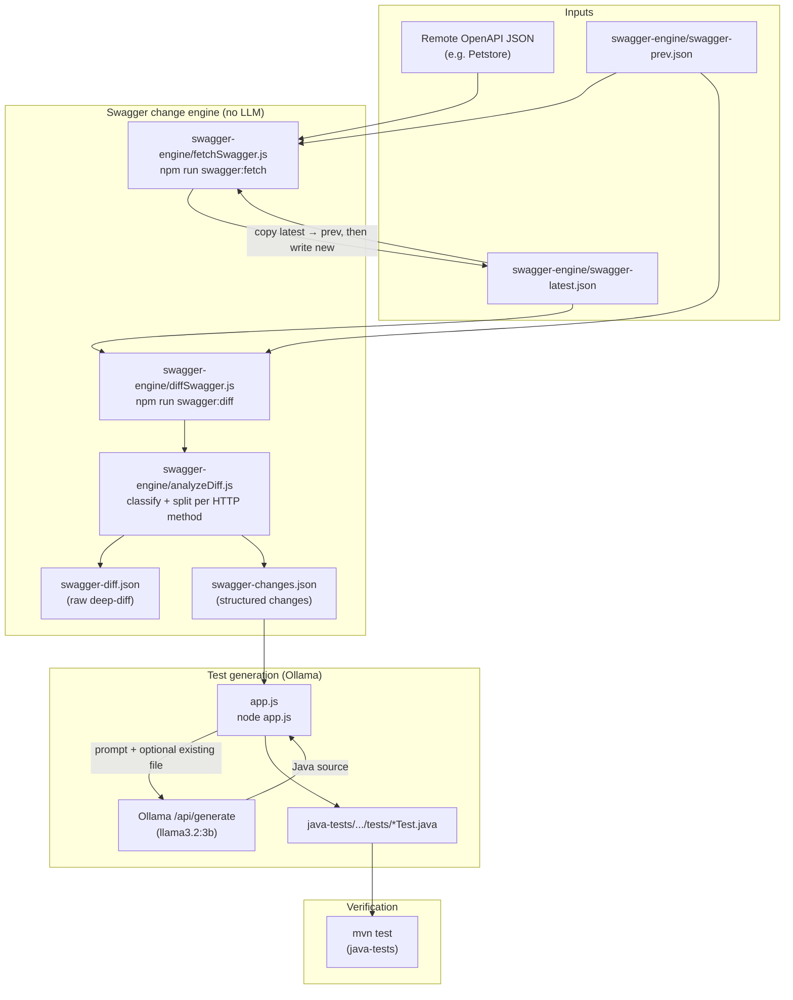
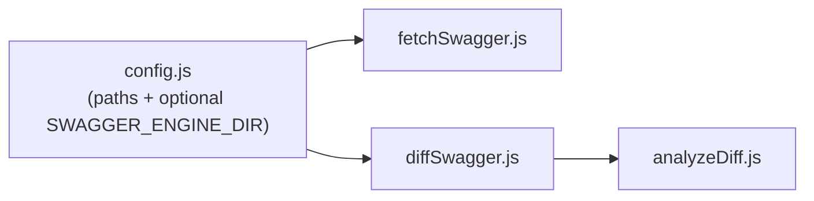

# Swagger AI

Node tooling that **fetches OpenAPI (Swagger) specs**, **diffs path-level changes**, and uses **Ollama** to generate or update **Java TestNG + Rest Assured** tests under `java-tests/`.

## End-to-end flow



### What each stage does

| Stage | Command / entry | Output |
|--------|------------------|--------|
| Fetch | `npm run swagger:fetch` | Updates `swagger-latest.json`; previous snapshot becomes `swagger-prev.json` when a prior latest exists. |
| Diff + analyze | `npm run swagger:diff` | Writes `swagger-diff.json` (path diff) and `swagger-changes.json` (categories: `ENDPOINT_CHANGE`, `BODY_CHANGE`, etc.). |
| AI update | `node app.js` | Reads `swagger-changes.json`, calls Ollama, writes/overwrites mapped `*Test.java` files. |

### Swagger engine layout



All engine artifacts live under **`swagger-engine/`** so the repo root stays clean. Override the folder with:

```bash
SWAGGER_ENGINE_DIR=/path/to/engine node app.js
```

### Docker / CI (conceptual)

- **Docker Compose**: `ollama` service + `swagger-app` running `node app.js` with `OLLAMA_HOST=http://ollama:11434`.
- **GitHub Actions** (`.github/workflows/api-test.yml`): Ollama service, `npm install`, pull model, `node app.js`, then `mvn clean test` in `java-tests/`.

## Prerequisites

- Node 18+
- Java 17 + Maven (for `java-tests`)
- Ollama running locally (or `OLLAMA_HOST` pointing at your server) with model **`llama3.2:3b`** pulled

## Quick start

```bash
npm install
npm run swagger:fetch    # refresh spec snapshots
npm run swagger:diff     # regenerate diff + analyzed changes
node app.js              # apply changes via Ollama → Java tests
cd java-tests && mvn test
```

## Notes

- **Class names** are tied to the target filename (e.g. `PutpetTest.java` → `public class PutpetTest`); `app.js` enforces that after generation so the model cannot rename classes from `operationId` alone.
- **Endpoint renames** in the spec (e.g. typo path → correct path) are paired **per HTTP method** so POST and PUT map to different test files (`PostpetTest`, `PutpetTest`, etc.).
