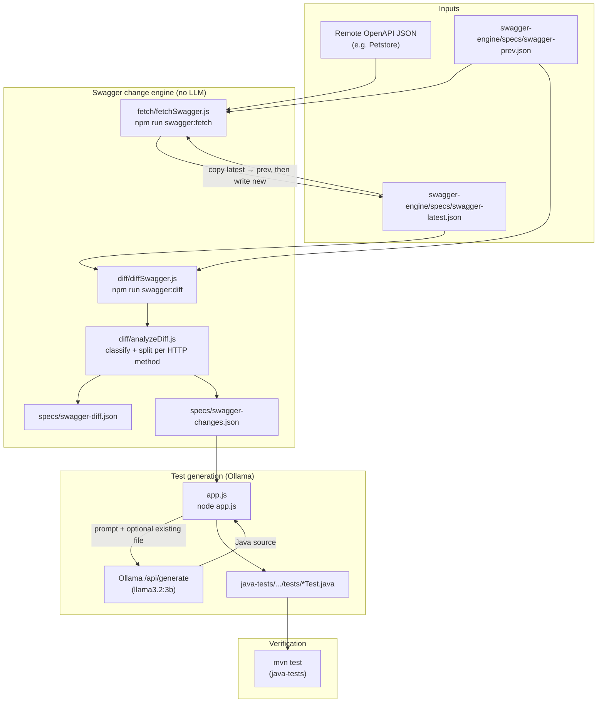
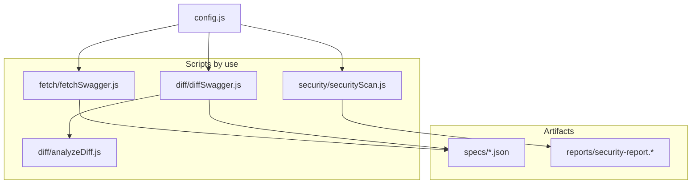
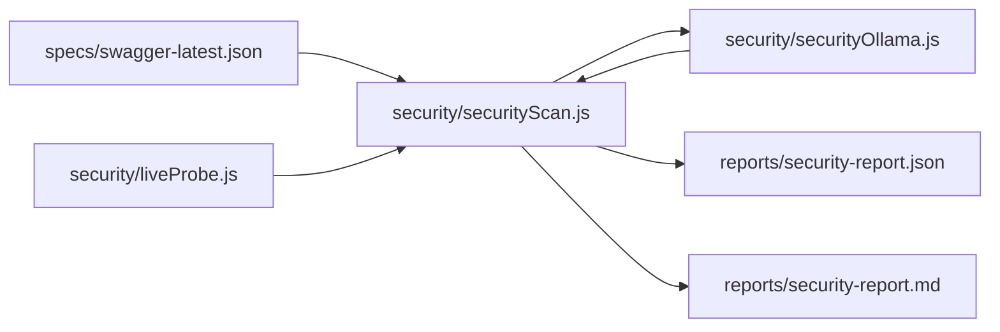

# Swagger AI

Node tooling that **fetches OpenAPI (Swagger) specs**, **diffs path-level changes**, and uses **Ollama** to generate or update **Java TestNG + Rest Assured** tests under `java-tests/`.

## End-to-end flow



### What each stage does

| Stage | Command / entry | Output |
|--------|------------------|--------|
| Fetch | `npm run swagger:fetch` | Updates `swagger-engine/specs/swagger-latest.json`; previous snapshot becomes `specs/swagger-prev.json` when a prior latest exists. |
| Diff + analyze | `npm run swagger:diff` | Writes `specs/swagger-diff.json` (path diff) and `specs/swagger-changes.json` (categories: `ENDPOINT_CHANGE`, `BODY_CHANGE`, etc.). |
| AI update | `node app.js` | Reads `swagger-changes.json`, calls Ollama, writes/overwrites mapped `*Test.java` files. Prompts include [docs/FRAMEWORK.md](docs/FRAMEWORK.md) (layered tests → services → core → models). |

### Swagger engine layout

Scripts and outputs are grouped under **`swagger-engine/`** — see [swagger-engine/README.md](swagger-engine/README.md).



Override the engine root with:

```bash
SWAGGER_ENGINE_DIR=/path/to/engine node app.js
```

If **`specs/swagger-changes.json` looks empty or never updates**, check the terminal output from `npm run swagger:diff`: it prints the **absolute paths** where files were written. Common causes: **`SWAGGER_ENGINE_DIR`** is set (outputs go to that folder, not the copy you have open in the editor), the command was run from a **different clone**, or the IDE buffer did not reload from disk (reopen the file or **Reload from Disk**). When `swagger-prev.json` and `swagger-latest.json` are **identical**, `swagger-changes.json` is valid JSON **`[]`** (no API changes), not a blank file.

### Docker / CI (conceptual)

- **Docker Compose**: `ollama` service + `swagger-app` running `node app.js` with `OLLAMA_HOST=http://ollama:11434`.
- **GitHub Actions** (`.github/workflows/api-test.yml`): Ollama service, `npm install`, pull model, `node app.js`, then `mvn clean test` in `java-tests/`.

## Prerequisites

- Node 18+
- Java 17 + Maven (for `java-tests`)
- Ollama running locally (or `OLLAMA_HOST` pointing at your server) with a model pulled (default **`llama3.2:3b`**; override with **`OLLAMA_MODEL`**)

## Quick start

```bash
npm install
npm run swagger:fetch    # refresh spec snapshots
npm run swagger:diff     # regenerate diff + analyzed changes
node app.js              # apply changes via Ollama → Java tests
cd java-tests && mvn test
```

## Security scanning

Runs an **OWASP API Security Top 10 (2023)**–oriented review: **Ollama** analyzes a **truncated OpenAPI JSON** excerpt from `swagger-engine/specs/swagger-latest.json`, plus optional **live HTTP probe** results (`API_BASE_URL`). There is **no** separate static rule engine and **no** OWASP ZAP integration—only LLM-structured output from your spec and probes.

**Advisory only:** this is not a penetration test, not OWASP ZAP, and not a certification. See [OWASP API Security](https://owasp.org/www-project-api-security/).

```bash
# Requires Ollama and a spec at swagger-engine/specs/swagger-latest.json
export API_BASE_URL=https://petstore.swagger.io/v2   # optional; adds probe facts for the model
npm run security:scan
```

Outputs (always written when the script finishes, even if Ollama fails):

- `swagger-engine/reports/security-report.json` — includes `findings` (flattened OWASP-tagged rows), `llm` raw analysis, `liveProbe`
- `swagger-engine/reports/security-report.md` — same content as Markdown (open this path after each run)

If `SWAGGER_ENGINE_DIR` is set, both files are written under **that directory** instead—check the console lines `Wrote Markdown: /absolute/path/...`.

### Environment variables

| Variable | Purpose |
|----------|---------|
| `API_BASE_URL` | Base URL for live probes (no trailing slash). If unset, analysis is **spec-only** (still sent to Ollama). |
| `OLLAMA_HOST` | Ollama base URL (default `http://localhost:11434`). |
| `OLLAMA_MODEL` | Model tag (default `llama3.2:3b`). |
| `OLLAMA_SECURITY_JSON_FORMAT` | Default `0`: plain text JSON from the model (avoids echoing the OpenAPI doc when `format: json` is on). Set to `1` only if your model reliably returns the analysis schema with `format: json`. |
| `SECURITY_PROBE_ALLOW_MUTATING` | Default `0`: only **GET** and **HEAD**. Set to `1` to also allow **OPTIONS** and **DELETE** (still no POST bodies). |
| `SECURITY_PROBE_MAX_ENDPOINTS` | Cap live probes (default `25`). |
| `SECURITY_PROBE_TIMEOUT_MS` | Per-request timeout (default `10000`). |
| `SECURITY_PROBE_AUTH_HEADER` | Value for the `Authorization` header on probes (e.g. `Bearer <token>`). |

### Flow (security)



## Notes

- **Framework instructions for Ollama** live in **[docs/FRAMEWORK.md](docs/FRAMEWORK.md)**. `app.js` loads that file on each run and injects it into the prompt so generated Java matches **services** (`PetService`, `UserService`), **core** (`RequestSpecBuilderUtil`, `ConfigReader`), **models** / `TestDataBuilder`, and **utils** (`ResponseValidator`). Edit that doc when you change conventions.
- **Class names** are tied to the target filename (e.g. `PutpetTest.java` → `public class PutpetTest`); `app.js` enforces that after generation so the model cannot rename classes from `operationId` alone.
- **Endpoint renames** in the spec (e.g. typo path → correct path) are paired **per HTTP method** so POST and PUT map to different test files (`PostpetTest`, `PutpetTest`, etc.).
- **Verifying regeneration:** If you remove a hand-maintained test (e.g. `PetCrudTest.java`), run `npm run swagger:diff` then `node app.js` with a non-empty `swagger-changes.json`; the tool writes **per-endpoint** files under `java-tests/src/test/java/tests/` (not a combined CRUD class) unless you change `getJavaFileNameFromChange` in `app.js`.

### Environment variables (`node app.js`)

| Variable | Purpose |
|----------|---------|
| `OLLAMA_HOST` | Ollama base URL (default `http://localhost:11434`). |
| `OLLAMA_MODEL` | Model tag (default `llama3.2:3b`). |
| `OLLAMA_TEMPERATURE` | Sampling temperature for `/api/generate` (default `0.2`). |
